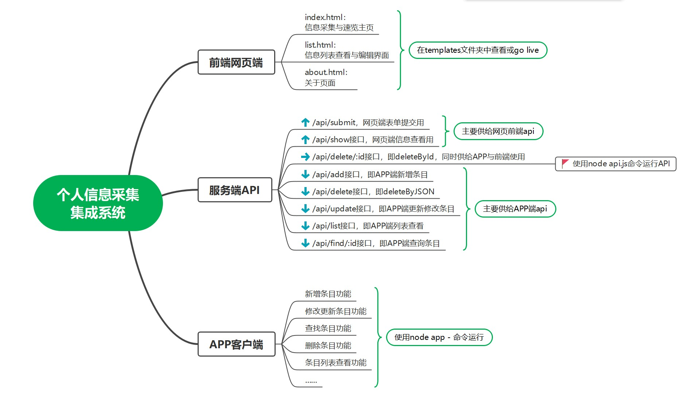

## 实验二-dace
### 个人信息采集

> Guan, 2022-12-12

1. 实验目的  
    本实验考察对Web Service理论掌握的情况，通过⼀个具体的Web应用的前后端编写，实现相应的REST风格Web API，服务于前端网页、以及各种API调用。通过该实验过程，可以了解REST架构风格的特点、集合类资源的Web API设计方式、以JSON为格式的表述方法，从而加深对Web Service理论的理解。

2. 实验要求
    1. 编写网页前端，实现对人员信息的基本采集，包括：姓名、学号、邮箱、手机号码、个人兴趣，共5项内容。其中，对学号、邮箱、手机号码应采取正则匹配验证（服务端或客户端验证，自行选择），对姓名、个人兴趣采取字符长度限制（姓名不超过8个中文字符，个人兴趣不超过32个中文字符，自行选择采取服务端或客户端验证）。

    2. 网页端页面流转逻辑参照课堂上所讲的 <b>YOUTYITWEPOSTIT</b> 网站逻辑。

    3. 编写客户端App代码，以独立应用程序的方式完成相应的功能，包括：
        1. 添加一条新的条目；
        2. 删除一条已存在的条目。条目不存在时，给予错误提示；
        3. 修改一条已存在的条目的内容，条目不存在时，给予错误提示；
        4. 对所有的条目列表输出，并可以指定按照条目中的时间，升序或降序列表；
        5. 其它自定义的功能(可选，如:可采用模版文件的方式增加、修改服务端的资源)。

    4. 编写服务端代码，以响应前端的请求。服务端除响应前端的网页请求外，还以API方式提供相应的服务，包括：
        - 对条目的新增(add)
        - 对条目的删除(deleteByld)
        - 对条目的修改(updateByld)
        - 对所有条目的列表(list)
        - 其它自定义的功能(可选，如:支持模版文件的增加、修改等)

    5. 信息资源以JSON方式组织，对信息条目的新增、删除、修改支持模版方式。（参照collection+json，自行定义资源模版）

    6. 本实验不限定所采用的编程语言，可以根据个人的偏好，自行选择。实验所准备的代码`type`仅供参考。

3. 文件说明
    1. data文件夹：本地存放资源数据与测试文件
    2. templates文件夹：存放网页前端网页文件
        1. index.html：网页前端主页，个人信息收集主页
        2. about.html：网页前端关于页面
        3. list.html：网页前端列表查看页面
        4. index.js：网页前端主页js文件
        5. collection.json：网页前端资源模版文件
    3. api.js：api接口文件，包含了所有的api接口，运行：`node api.js`即可启动服务，默认启动在`localhost:1337`，可通过`-p`参数指定端口号，如启动在其他端口，请自行修改`app.js`与前端网页中各处api网址
    4. app.js：客户端App文件，运行：`node app -h`即可启动运行，查看帮助
    5. README.md：说明文档，即本文件
    6. 整体介绍图示：

4. 项目运行
    本项目运行时可遵循以下步骤：
    1. 通过npm install在项目下配置安装所需node包，文件中已给出package配置文件；
    2. 运行api：在目录下运行node api.js，打开API服务。
    3. 接下来便可以查看前端网页与APP端了！
        1. 前端网页：在浏览器中打开templates文件夹下的index.html，即可查看前端网页。
        2. APP端：在命令行中运行node app.js，即可查看APP端。

#### 个人代码，仅供参考，衷心感谢！